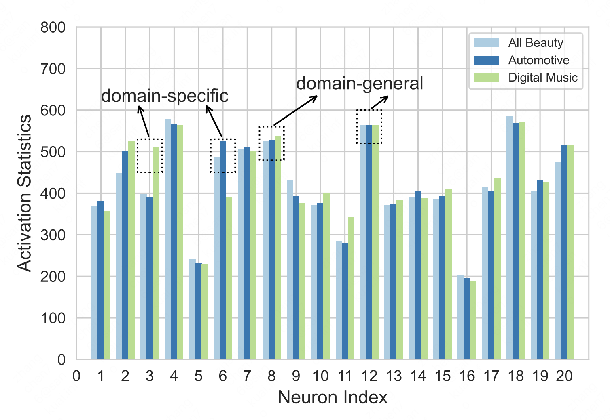
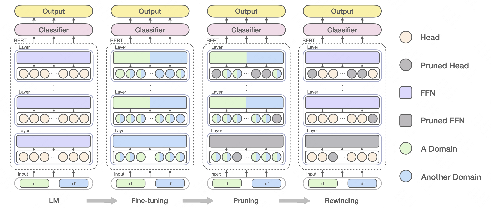

## DogeTickets

This repository contains code and data for NLPCC 2022 paper titled [Doge Tickets: Uncovering Domain-general Language Models by Playing Lottery Tickets.](https://arxiv.org/abs/2207.09638).

**************************** **Updates** ****************************

<!-- Thanks for your interest in our repo! -->

* 9/25/22: Our paper accepted Best Paper Award at NLPCC 2022!
* 9/5/22: We released our paper. Check it out!
* 9/1/22: We released our code and data. Check it out!

## Quick Links

  - [Overview](#overview)
  - [Getting Started](#getting-started)
    - [Requirements](#requirements)
    - [Training](#training)
    - [Pruning](#pruning)
    - [Rewinding](#rewinding)
  - [Case Study](#case-study)
  - [Bugs or Questions?](#bugs-or-questions)
  - [Citation](#citation)

## Overview

It is recognized that, when LMs are faced with multiple domains, a critical portion of parameters behave unexpectedly in a domain-specific manner while others behave in a domain-general one. Motivated by this phenomenon, we for the first time posit that domain-general parameters can underpin a domain-general LM that can be derived from the original LM. To uncover the domain-general LM, we propose to identify domain-general parameters by playing lottery tickets (dubbed doge tickets).

 

## Getting Started

### Requirements

- PyTorch
- Numpy
- Transformers

### Training

We provide example training scripts. For example, in `scripts/train_amazon.sh`. We explain the arguments in the following:
* `--model_type`: Plug model with mask or not, default to `cls_tuning_with_mask`.
* `--model_name_or_path`: Path to pretrained model for training, init model for rewinding.
* `--task_name`: Name to indicate the task.
* `--train_data_domains`: Domains for training.
* `--test_data_domains`: Domains for test.

### Pruning

We also provide example pruning scripts. For example, in `scripts/mask_amazon.sh`, arguments share similar meanings as those in training ones, with a few additional arguments as follows:
* `--do_mask_with_domain`: Compute doge tickets or winning tickets, default to winning tickets.
* `--normalize_by_layer`: Whether normalize important scores per layers.

### Rewinding

We also provide example rewinding scripts, for example `scripts/rewind_amazon.sh`, where arguments share similar meaning as those in training ones, with a few additional arguments as follows:
* `--head_mask_file`: Path to the file output by pruning to denote which heads should be pruned.
* `--ffn_mask_file`: Path to the file output by pruning to denote which ffns should be pruned.
* `--sparsity`: Sparsity being considered.

## Bugs or Questions?

If you have any questions related to the code or the paper, feel free to email Yi (`yang.yi@bit.edu.cn`) or Chen (`czhang@bit.edu.cn`). If you encounter any problems when using the code, or want to report a bug, you can open an issue. Please try to specify the problem with details so we can help you better and quicker!

## Citation

Please cite our paper if you use the code or data in your work:

```bibtex
@inproceedings{yang2022doge,
   title={Doge Tickets: Uncovering Domain-general Lnaguage Models by Playing Lottery Tickets},
   author={Yang, Yi and Zhang, Chen and Wang, Benyou and Song, Dawei},
   booktitle={NLPCC},
   year={2022}
}
```

## Credits

Our code is partly borrowed from [super tickets](https://github.com/cliang1453/super-structured-lottery-tickets).
